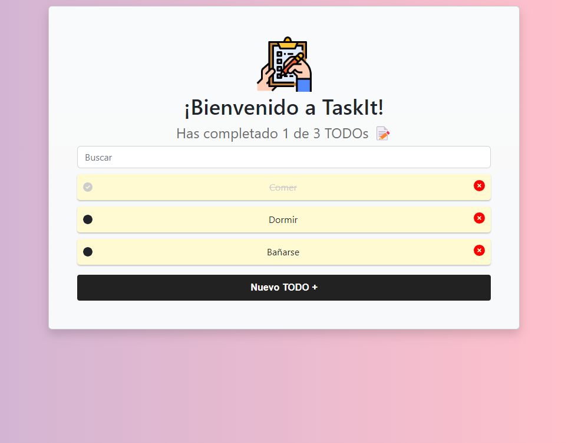
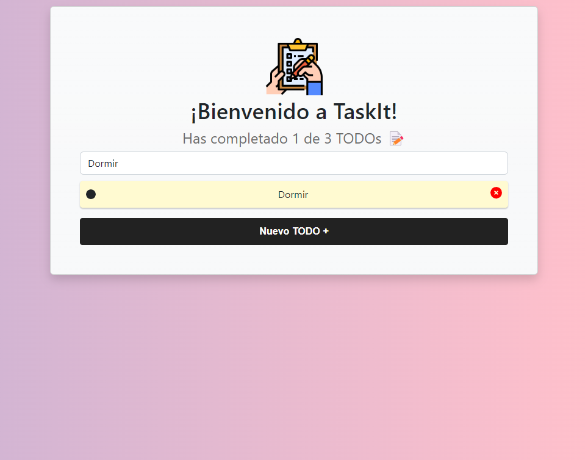

# TODO App - ReactJS

    

## Table of contents
* [General info](#General-info)
* [How to Install and Run the Project](#How-to-Install-and-Run-the-Project)
* [Technologies](#Technologies)
* [Features](#Features)
* [License](#License)

## General info

This TODO app was created as a learning project to gain experience with ReactJS, JavaScript, and CSS. It uses localStorage to store the tasks and has a simple design that is easy to use. The app allows users to add, edit, and delete tasks, as well as mark them as completed.

The app is built using a component-based architecture, with each component responsible for a specific part of the app's functionality. This approach makes the code more modular and easier to maintain.

Through building this app, I gained experience with ReactJS, including working with components, state management, and event handling. I also learned how to use localStorage to persist data in the browser and how to use CSS to style the app.

I hope that this app can be useful for others who are learning ReactJS or looking for a simple TODO app to use.

## How to Install and Run the Project

### Prerequisites

* Node.js (version 14 or higher)
* npm (version 6 or higher)
* Docker (if you want to build and deploy the application as a container)

### Running the Application Locally

To run the application locally, follow these steps:

1. Clone the repository to your local machine using `git clone https://github.com/LeooZeballos/todo-app.git`.
2. Navigate to the project directory using `cd todo-app`.
3. Install the dependencies using `npm install`.
4. Start the development server using `npm start`.
5. Open your web browser and navigate to `http://localhost:3000` to view the application.

### Building and Deploying the Application as a Docker Container

To build and deploy the application as a Docker container, follow these steps:

1. Clone the repository to your local machine using `git clone https://github.com/LeooZeballos/todo-app.git`.
2. Navigate to the project directory using `cd todo-app`.
3. Build the Docker image using `docker build -t todo-app .`.
4. Run the Docker container using `docker run -p 3000:3000 todo-app`.
5. Open your web browser and navigate to `http://localhost:3000` to view the application.

## Technologies

## Features

### Users can add new tasks to the list.

### Users can view a list of existing tasks, mark them as complete, and delete them

### Users can search for tasks by name

## License

MIT License

Copyright (c) 2023 Leonel Zeballos

Permission is hereby granted, free of charge, to any person obtaining a copy
of this software and associated documentation files (the "Software"), to deal
in the Software without restriction, including without limitation the rights
to use, copy, modify, merge, publish, distribute, sublicense, and/or sell
copies of the Software, and to permit persons to whom the Software is
furnished to do so, subject to the following conditions:

The above copyright notice and this permission notice shall be included in all
copies or substantial portions of the Software.

THE SOFTWARE IS PROVIDED "AS IS", WITHOUT WARRANTY OF ANY KIND, EXPRESS OR
IMPLIED, INCLUDING BUT NOT LIMITED TO THE WARRANTIES OF MERCHANTABILITY,
FITNESS FOR A PARTICULAR PURPOSE AND NONINFRINGEMENT. IN NO EVENT SHALL THE
AUTHORS OR COPYRIGHT HOLDERS BE LIABLE FOR ANY CLAIM, DAMAGES OR OTHER
LIABILITY, WHETHER IN AN ACTION OF CONTRACT, TORT OR OTHERWISE, ARISING FROM,
OUT OF OR IN CONNECTION WITH THE SOFTWARE OR THE USE OR OTHER DEALINGS IN THE
SOFTWARE.
